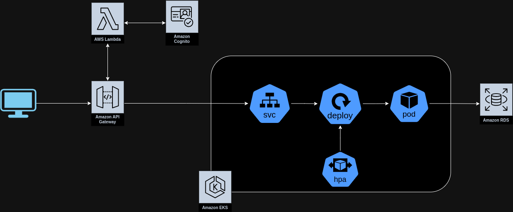

# lanchonete-lambda-infra
Repositório referente a infra-estrutura do banco de dados RDS na AWS utilizado no projeto da lanchonete do grupo 11.

## Arquitetura geral do projeto
[Video explicativo arquitetura]()


## Como configurar as credenciais da conta da AWS

Para configurar as credencias IAM localmente e  autenticar o Terraform na AWS, configure o arquivo ~/.aws/credentials com as credencias da conta AWS.

```
[default]
aws_access_key_id=XXXXXX
aws_secret_access_key=YYYYYY
aws_session_token=ZZZZZZ
```

## Como criar infra

1. Criar infra com o terraform
```
terraform init

terraform plan

terraform apply -auto-approve
```